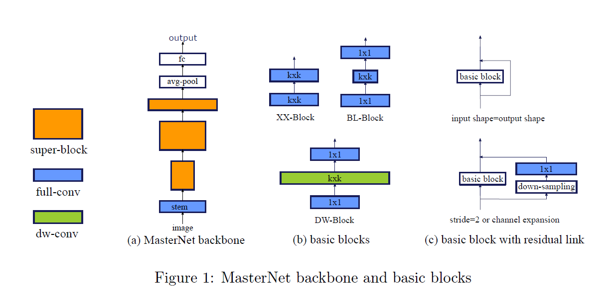

# Neural Architecture Design for GPU-Efficient Networks
  
## 目录

- [1. 简介]()
- [2. 数据集和复现精度]()
- [3. 准备数据与环境]()
    - [3.1 准备环境]()
    - [3.2 准备数据]()
    - [3.3 准备模型]()
- [4. 开始使用]()
    - [4.1 模型评估]()
    - [4.2 TIPC基础链条测试]()
- [5. LICENSE]()
- [6. 参考链接与文献]()


## 1. 简介

- 论文: Ming Lin, Hesen Chen, Xiuyu Sun, Qi Qian, Hao Li, Rong Jin. Neural Architecture Design for GPU-Efficient Networks. arXiv:2006.14090 [cs.CV]. June 2020. [[arXiv](https://arxiv.org/abs/2006.14090)]

- 参考repo: [GPU-Efficient-Networks](https://github.com/idstcv/GPU-Efficient-Networks)

在此非常感谢 `$idstcv$` `$MingLin-home$`等人贡献的[GPU-Efficient-Networks](https://github.com/idstcv/GPU-Efficient-Networks)，提高了本repo复现论文的效率。

- aistudio体验教程: [aistudio](https://aistudio.baidu.com/aistudio/projectdetail/4404628)

- paper reading:

  - 目标：设计一套GPU推理高效的且高性能的模型结构。设计一个高效的高精度网络，专门针对现代GPU上的快速推理进行优化
  - 设计灵感：This design is inspired by the observation that convolutional kernels in the high-level stages are more likely to have low intrinsic rank and different types of convolutions have different kinds of efficiency on GPU.
  - 设计原则：low-level stages使用全卷积(XX-Block)，high-level stages使用dw卷积(DW-Block)和bottleneck卷积(BL-Block)。结构如下：

  - 设计过程：根据gpu端高效网络的设计原则，通过LLR-NAS来设计高效网络。

## 2. 数据集和复现精度

repo用到的数据集是imagenet数据集的验证集，具体参见：

- 数据集大小：数据集总共有50000张图像，。

- 数据集下载链接：[ILSVRC2012_img_val.tar](https://aistudio.baidu.com/aistudio/datasetdetail/68594)

- 数据格式：

  > """
  >
  > ├─imgs
  >
  >     ├──ILSVRC2012_val_00000001.JPEG
  >
  >     ├──ILSVRC2012_val_00000002.JPEG
  >
  > └─val_list.txt
  >
  > """

复现精度：

|                  |    环境(env)     |    精度（acc） | 延迟(latency)   |
| ---------------  | --------------- | -------------- | -------------- |
| 原论文GENet-large | V100 FP16 B=64  |   81.3%        |   0.34         |
| 复现GENet_large   | V100 FP16 B=64  |   81.379%      |   6.895        |

这里复现的延迟较大，是因为复现时环境的cpu较少，只有2核，workers设置为8造成的。

## 3. 准备数据与环境

### 3.1 准备环境

使用硬件和框架版本等环境的要求如下：

- 硬件：Nvidia Tesla v100 16G x1
- 框架：
  - PaddlePaddle >= 2.3.1

库安装：

- PaddlePaddle：建议参照[Paddle官方页面](https://www.paddlepaddle.org.cn/install/quick?docurl=/documentation/docs/zh/install/pip/linux-pip.html)安装，或执行以下命令：

```shell
python -m pip install paddlepaddle-gpu==2.3.1 -i https://mirror.baidu.com/pypi/simple
```

- 其余库：

AI-Studio都有安装，可直接使用。或执行：
```shell
pip install -r requirements.txt
```

### 3.2 准备数据

可参见2中数据格式，将自定义数据集按照该格式整理即可使用。

### 3.3 准备模型

- 预训练模型(paddle)：[BAIDUYUN](https://pan.baidu.com/s/1u-90N6kehZAyYBvM7QgQ8g): l5hu
- 原repo提供的pytorch模型：[GENet_large](https://idstcv.oss-cn-zhangjiakou.aliyuncs.com/GENet/GENet_large.pth)、[GENet_normal](https://idstcv.oss-cn-zhangjiakou.aliyuncs.com/GENet/GENet_normal.pth)、[GENet_small](https://idstcv.oss-cn-zhangjiakou.aliyuncs.com/GENet/GENet_small.pth)

## 4. 开始使用

### 4.2 模型评估

```shell
python val.py --gpu 0 --data /path/to/imgs --arch GENet_large --params_path /path/to/genet_large.pdparams --config /path/to/val_list.txt --batch_size 64 --workers 8
```

日志如下：


### 4.2 TIPC基础链条测试

暂无

## 5. LICENSE

licensed under the Apache License 2.0

## 6. 参考链接与文献
- [GPU-Efficient-Networks](https://github.com/idstcv/GPU-Efficient-Networks)
- Ming Lin, Hesen Chen, Xiuyu Sun, Qi Qian, Hao Li, Rong Jin. Neural Architecture Design for GPU-Efficient Networks. arXiv:2006.14090 [cs.CV]. June 2020. [[arXiv](https://arxiv.org/abs/2006.14090)]
