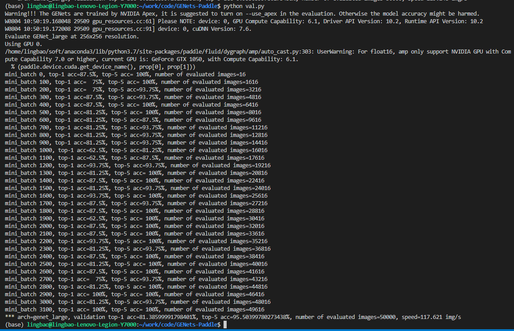

# GENets-Paddle
paper replay in paddle(Neural Architecture Design for GPU-Efficient Networks)

# read paper
- 目标：设计一套GPU推理高效的且高性能的模型结构。设计一个高效的高精度网络，专门针对现代GPU上的快速推理进行优化
- 设计灵感：This design is inspired by the observation that convolutional kernels in the high-level stages are more likely to have low intrinsic rank and different types of convolutions have different kinds of efficiency on GPU.
- 设计原则：low-level stages使用全卷积，high-level stages使用dw卷积和bottleneck卷积。结构如下：

- 设计过程：根据gpu端高效网络的设计原则，通过LLR-NAS来设计高效网络。

# 原论文实验结果

# 复现过程
- 数据：[ILSVRC2012_img_val.tar](https://aistudio.baidu.com/aistudio/datasetdetail/68594)
- 预训练模型：从原repo中下载模型后，执行gen_pretrained.py将pytorch模型转换为paddle模型。[paddle模型](https://pan.baidu.com/s/1u-90N6kehZAyYBvM7QgQ8g)(l5hu)：GENet_large、GENet_normal、GENet_small。(原repo提供的pytorch模型：[GENet_large](https://idstcv.oss-cn-zhangjiakou.aliyuncs.com/GENet/GENet_large.pth)、[GENet_normal](https://idstcv.oss-cn-zhangjiakou.aliyuncs.com/GENet/GENet_normal.pth)、[GENet_small](https://idstcv.oss-cn-zhangjiakou.aliyuncs.com/GENet/GENet_small.pth))
- 评估模型：执行val.py，结果如下：

# Acknowledgement
感谢[GPU-Efficient-Networks](https://github.com/idstcv/GPU-Efficient-Networks)
